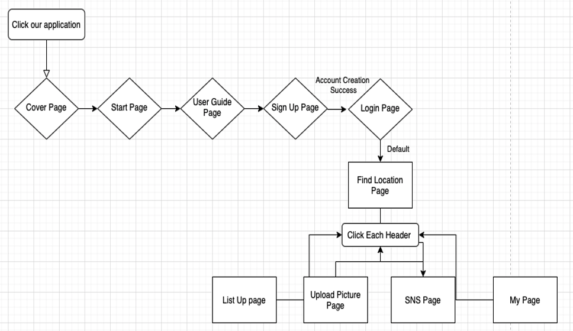

# SWE3028_Capstone Project_Team H

> Topic : CNN based Location Image Search and its Adaptation to Social Network, PINPLACE
>
> Team Member : 엄지용, 이지섭, 정채원, 채승윤, 홍성준
> 

 

# Introudction of PINPLACE

<h2>0. Summary</h2>

 

<h2> 1. Objective </h2>
 “CNN based place recognition web app”
  
- 01. Service of place recognition feature & SNS feature.
  
- 02. Collect data set & Build CNN models which have the best accuracy
  
- 03. Work on UI design & graphic Design
  
- 04. Apply CNN models on web app
 

<h2> 2. Application's Structure </h2>
<h3> a. User Flow </h3>
 
 The following is a user flow diagram, which shows the connectivity and hierarchy between our web pages.
 

  

------------------------------------------------------------------------------

<h3> b. Page Lists (10 pages) </h3>

≪  Cover page / Start Page / User Guide Page / Signup Page / Login Page    
 / Find Location Page / List Up Page / Upload Picture Page / SNS Page / My Page  ≫ 

 

------------------------------------------------------------------------------

<h3> c. Description of each page  </h3>

	
a.	Cover page :
 Since it is the first screen that users face, We designed the logo ourselves because we thought we had to firmly convey the platform brand image.
 

b.	Start Page :
 This page is expressed in fancy graphics to roughly imply the functionality of our platform 
	 

c.	User Guide Page :
 For optimal UX, we made this page with Card UI. Every time user turn the page, the content and design are designed to be different.  

d.	Sign Up Page :
 This page is for new users who want to make an account for this service. Currently this includes four text or password boxes, and a submission button.  

e.	Login Page :
 To use the service, users need to sign in via this page. Among the information provided in the sign-up page, ID is unique for each user: thus, ID and password are needed to log in. Additionally, there is the button to the sign-up page for who doesn’t have an account for this service.  

f.	Find Location Page :
 This page is core function page. We connect with CNN model that we made ourselves.   

g.	List Up page :
 This page shows the list of places serviced, by popularity. Popularity can be measured by daily, weekly, or monthly. Each place entry is clickable and shows a subpage for that place.  

h.	Upload Picture Page :
 This page is prepared for improving AI model, so the location information for the picture is necessary. The dropdown list for locations needed is served.  

 
i.	SNS Page :
On the SNS page, you can see recommendations for places shared by celebrities.

j.	My Page :
This is the own user page for a user logged in, which shows pictures uploaded by that user from find location page. 

 
 

# Output
<h3> 1. Initial UI design </h3>
https://www.figma.com/file/kPRSZqt6wzZ49x4qpmfjma/캡스톤-UI?node-id=0%3A1
 
<h3> 2. Final Report </h3>

[Final Report By Team H](https://github.com/SecAI-Lab/SWE3028/blob/main/Team-H/Capstone_final_report_team_H.pdf)

<h3> 3. Final Presentation </h3>
 
<h3> 4. DEMO </h3>

[Final Demo Video](https://github.com/SecAI-Lab/SWE3028/blob/main/Team-H/Demo.mp4)

