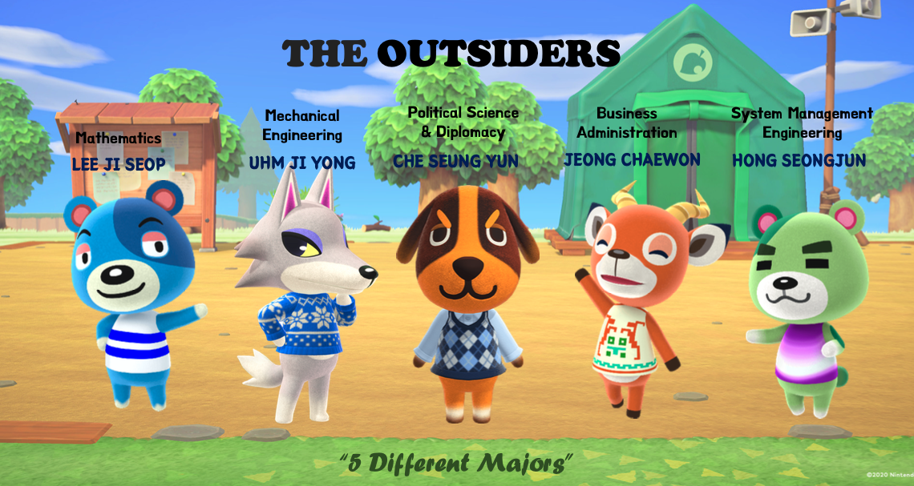
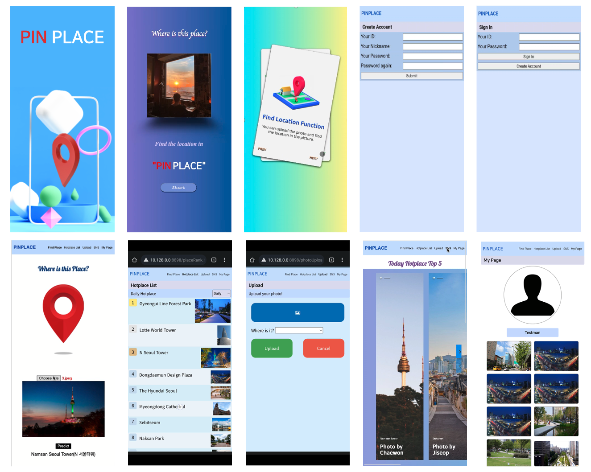
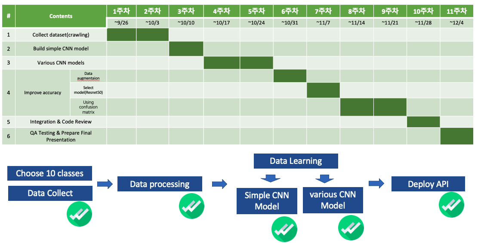
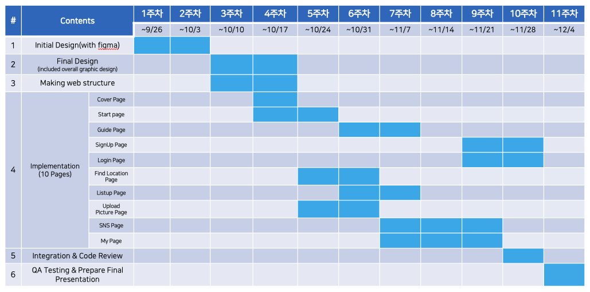

# SWE3028_Capstone Project_Team H

[](#license)

> Topic : CNN based Location Image Search and its Adaptation to Social Network, PINPLACE
>
> Team Member : 엄지용, 이지섭, 정채원, 채승윤, 홍성준
> 
> 
[](#license)
 

# Introudction of PINPLACE


## 0. Summary


<br>

[](#license)

## 1. Objective

 “CNN based place recognition web app”


  1. Service of place recognition feature & SNS feature.
  2. Collect data set & Build CNN models which have the best accuracy
  3. Work on UI design & graphic Design
  4. Apply CNN models on web app
   
<br>


[](#license)


## 2. Application's Structure
- ### User Flow
 ```
 The following is a user flow diagram, which shows the connectivity and hierarchy between our web pages.
 ```


 <br>

------------------------------------------------------------------------------

- ### Page Lists (10 pages)
```
≪  Cover page / Start Page / User Guide Page / Signup Page / Login Page/
 Find Location Page / List Up Page / Upload Picture Page / SNS Page / My Page  ≫
 ```

 
 

------------------------------------------------------------------------------

- ### Description of each page

	
  - Cover page :
 Since it is the first screen that users face, We designed the logo ourselves because we thought we had to firmly convey the platform brand image.
<br>

  - Start Page :
 This page is expressed in fancy graphics to roughly imply the functionality of our platform<br>

  - User Guide Page :
 For optimal UX, we made this page with Card UI. Every time user turn the page, the content and design are designed to be different. <br>


  - Sign Up Page :
 This page is for new users who want to make an account for this service. Currently this includes four text or password boxes, and a submission button. <br>

  - Login Page :
 To use the service, users need to sign in via this page. Among the information provided in the sign-up page, ID is unique for each user: thus, ID and password are needed to log in. Additionally, there is the button to the sign-up page for who doesn’t have an account for this service. <br>


  - Find Location Page :
 This page is core function page. We connect with CNN model that we made ourselves.  <br>


  - List Up page :
 This page shows the list of places serviced, by popularity. Popularity can be measured by daily, weekly, or monthly. Each place entry is clickable and shows a subpage for that place. <br>


  - Upload Picture Page :
 This page is prepared for improving AI model, so the location information for the picture is necessary. The dropdown list for locations needed is served. <br>


 
  - SNS Page :
On the SNS page, you can see recommendations for places shared by celebrities.


  - My Page :
This is the own user page for a user logged in, which shows pictures uploaded by that user from find location page. 

[](#license)

<br>

## 3. CNN Build

### CNN model spec

- ResNet50 model is adopted

- Total image data : 25,450

- Training & validation data: 17,815

- Input Size : 128 * 128

- Train set, Validation set, Test set : 5:2:3

- Classes : 10

- Batch size : 32  epoch : 80

- Optimizer : Nadam

------------------------------------------------------------------------------

### Class List

Total 10 class

```
Dongdaemun_Design_Plaza, Gyeongui_Line_Forest_Park, Naksan_Park,
Namsan_Seoul_Tower, The_Hyundai_Seoul_Mall,  Myeongdong_Cathedral,
Ikseon_Dong_Hanok_Village, Jamsil_Lotte_Tower, Han_River_Sebitseom,
Haebangchon
```

------------------------------------------------------------------------------

### Tried CNN models

- Lenet-5 has three convolution layer, two pooling layer, one fully-connected layer and this have about 60,000 parameter to learn. This model is basic model of CNN.
- AlexNet model has five convolution layer, three pooling layer, two local response normalization layer, one fully-connected layer and this have about 62,000,000 parameter to learn.
- VGG16 model has 13 convolution layer, 5 pooling layer, three fully-connected layer and this have about 138,000,000 parameter to learn. This is much deeper model than AlexNet.
- ResNet model used idea of "skip connection" which solve the gradient vanishing problem which happens when model is deeper. It has 49 convolution layer with pooling layer and one fully-connected layer.

------------------------------------------------------------------------------

### Results of each models

|Model|Lenet-5|AlexNet|VGG16|ResNet50|
|:---:|:---:|:---:|:---:|:---:|
|Accuracy|66.3%|13.31%|12.79%|91.12%|

We Finaly choose ResNet50 model.

------------------------------------------------------------------------------

### Final Selected model

- [Final Model File](https://drive.google.com/file/d/1MFIPT5ijsCOwLAdOsRyfCbfzhh4M_r0I/view?usp=sharing) (If you want to download the trained model file click this)

[](#license)


# Project Progress

<h3> CNN Part </h3>

<br>
<h3> Web Part </h3>


[](#license)

# Output

## 1. Github Repository

- [Team H repository](https://github.com/Outsider-H/PINPLACE.git)

## 2. Inital UI design

- [UI Design](https://www.figma.com/file/kPRSZqt6wzZ49x4qpmfjma/캡스톤-UI?node-id=0%3A1)

## 3. Final Report

- [Final Report By Team H](https://github.com/SecAI-Lab/SWE3028/blob/main/Team-H/Capstone_final_report_team_H.pdf)

## 4. Final Presentation

- [Final presentation](https://github.com/SecAI-Lab/SWE3028/blob/main/final/Capstone_final_presentation_team_H.pdf)

## 5. Final CNN model file

- [Final CNN file](https://drive.google.com/file/d/1MFIPT5ijsCOwLAdOsRyfCbfzhh4M_r0I/view?usp=sharing)

## 6. DEMO

- [Demo vedio]()
